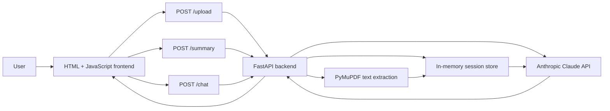

# DocChat

DocChat is an AI-powered document assistant that lets users upload a PDF, generate a plain-language summary, and ask questions about the document before signing or agreeing to it.

Live demo: https://web-production-c74f.up.railway.app/?v=3

## What It Does

- Upload one PDF document at a time
- Extract readable text from the PDF
- Generate a structured summary with key terms and risks
- Ask document-based questions in a simple chat interface
- Return answers grounded in the uploaded document

DocChat v1 is focused on everyday users reviewing leases, contracts, policy documents, or terms and conditions. It does not edit PDFs, store long-term document libraries, or provide legal advice.

## Architecture



Flow:

1. User uploads a PDF from the browser.
2. FastAPI receives the file and PyMuPDF extracts readable text.
3. The backend stores the `session_id`, extracted text, and chat history in memory.
4. Summary and chat requests send document context to Claude.
5. Claude's response returns through FastAPI and is displayed in the browser.

## Tech Stack

| Tool | Purpose |
|------|---------|
| Python | Backend language |
| FastAPI | API framework and static frontend hosting |
| PyMuPDF | PDF text extraction |
| Anthropic Python SDK | Claude API calls for summaries and answers |
| In-memory dictionary | v1 session storage |
| HTML, CSS, JavaScript | Lightweight frontend |
| Railway | Public deployment |

## API Endpoints

| Method | Endpoint | Purpose |
|--------|----------|---------|
| `GET` | `/health` | Confirms the server is running |
| `POST` | `/upload` | Uploads a PDF and creates a document session |
| `POST` | `/summary` | Generates a structured document summary |
| `POST` | `/chat` | Answers questions using the uploaded document |

## Local Setup

1. Clone the repo:

```bash
git clone https://github.com/jayanthuppara1/docchat.git
cd docchat
```

2. Create and activate a virtual environment:

```bash
python -m venv .venv
source .venv/bin/activate
```

3. Install dependencies:

```bash
pip install -r requirements.txt
```

4. Add your Anthropic API key:

```bash
cp backend/.env.example backend/.env
```

Then set:

```bash
ANTHROPIC_API_KEY=your_api_key_here
```

5. Run the app:

```bash
uvicorn backend.main:app --reload
```

6. Open the app:

```text
http://127.0.0.1:8000
```

FastAPI docs are available at:

```text
http://127.0.0.1:8000/docs
```

## Deployment

The app is deployed on Railway:

```text
https://web-production-c74f.up.railway.app/?v=3
```

The same FastAPI service serves both:

- API routes such as `/upload`, `/summary`, and `/chat`
- Static frontend files from `frontend/`

Railway uses:

- `Procfile`
- `railway.json`
- `requirements.txt`

## Project Structure

```text
docchat/
  backend/
    .env.example
    main.py
  docs/
    scope.md
    prd.md
    design.md
  frontend/
    index.html
    app.js
  Procfile
  railway.json
  requirements.txt
  README.md
```

## Product Docs

- [Scope](docs/scope.md)
- [PRD](docs/prd.md)
- [Design Document](docs/design.md)

## Notes

This project is a v1 prototype. It is intended to help users understand documents more quickly, but it does not provide legal advice.
