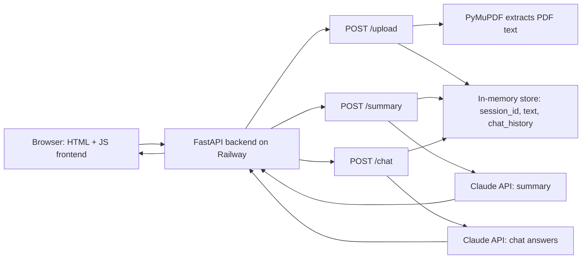

# DocChat v1 - Design Document

## 1. Tech Stack

| Tool | Purpose | Why we chose it |
|------|---------|-----------------|
| Python | Backend language | Industry standard for AI engineering |
| FastAPI | API framework | Auto-generates docs at /docs, easy to learn |
| PyMuPDF | PDF text extraction | Fast, reliable, 2 lines of code |
| Anthropic Python SDK | Call Claude API | Clean interface to the LLM |
| In-memory dict | Session storage | Zero setup, enough for v1 |
| Railway | Deployment | Stays awake on free tier, real public URL |
| HTML + JS | Frontend | Keeps focus on backend, no framework needed |

## 2. Architecture



### Request/Response Flow

1. User uploads a PDF from the browser.
2. FastAPI receives the file and PyMuPDF extracts readable text.
3. The backend stores the `session_id`, extracted text, and chat history in memory.
4. Summary and chat requests send document context to Claude.
5. Claude's response returns through FastAPI and is displayed in the browser.

## 3. API Endpoints

### POST /upload

- Request: PDF file (multipart/form-data)
- Response: `{ "session_id": "abc123", "filename": "lease.pdf", "page_count": 12 }`
- What it does: saves PDF, extracts text, and stores it in memory

### POST /summary

- Request: `?session_id=abc123`
- Response: `{ "overview": "...", "key_terms": ["..."], "risks": ["..."], "disclaimer": "..." }`
- What it does: retrieves document text, calls Claude, returns a structured summary and flagged risks

### POST /chat

- Request: `{ "session_id": "abc123", "message": "What is the deposit amount?" }`
- Response: `{ "answer": "According to section 3, the deposit is $1,500." }`
- What it does: retrieves document text, sends the question and context to Claude, returns an answer

### GET /health

- Request: none
- Response: `{ "status": "ok" }`
- What it does: confirms server is running and can be used by Railway

## 4. Data Model

```python
# One entry per uploaded PDF session
sessions = {
    "abc123": {
        "filename": "lease.pdf",
        "text": "Extracted PDF text...",
        "chat_history": [
            {"role": "user", "content": "What is the deposit?"},
            {"role": "assistant", "content": "The deposit is $1,500."}
        ]
    }
}
```

## 5. End-to-End Flow

When a user opens DocChat, they see a simple web page where they can upload a PDF. The user selects a PDF from their computer, and the browser sends that file to the FastAPI backend using the `POST /upload` endpoint.

The backend first validates that the uploaded file is a PDF. Once the file is accepted, FastAPI temporarily receives the file and passes it to PyMuPDF. PyMuPDF opens the PDF and extracts readable text from the pages.

Next, the backend creates a unique `session_id` for that uploaded PDF. It stores the filename, extracted text, and an empty chat history in an in-memory Python dictionary. The backend then sends the `session_id`, filename, and page count back to the browser. At this point, the browser knows which document session belongs to the user.

If the user clicks "Summarize," the browser sends the `session_id` to the `POST /summary` endpoint. FastAPI uses that `session_id` to find the stored document text, builds a prompt using the PDF content, and sends it to the Claude API. Claude returns a structured summary with key terms and possible risks or confusing clauses. FastAPI sends that response back to the browser, and the frontend displays it to the user.

If the user asks a question in the chat, the browser sends the `session_id` and the user's message to the `POST /chat` endpoint. FastAPI uses the `session_id` to retrieve the document text, combines the user's question with the document context, and calls Claude again. Claude generates an answer based on the uploaded PDF content, and FastAPI returns that answer to the browser.

The frontend then displays the answer in the chat interface and stores the interaction in the session chat history. This allows the user to continue asking follow-up questions about the same document without uploading the PDF again. If the system cannot find the answer in the uploaded document, it should clearly say that the answer was not found instead of guessing.
